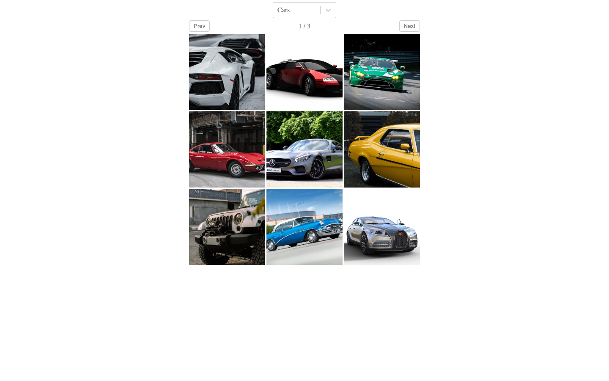
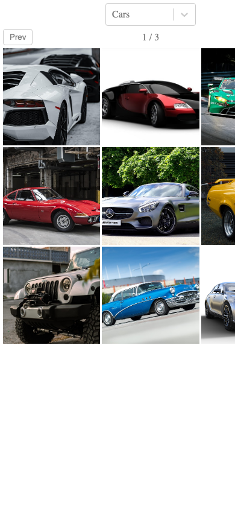

# Images API Gallery

A React image-search gallery that fetches image results, displays them in a paginated grid, and opens an image-detail preview.

**Live site:** [onchetrit.github.io/images-api](https://onchetrit.github.io/images-api/)

## Highlights

- Category-based image search.
- Paginated image grid.
- Image preview modal with creator and image details.

## Tech

React, Redux, Redux Thunk, Axios, SCSS, and Create React App.

## Screenshots

| Desktop | Image detail | Mobile |
| --- | --- | --- |
|  |  |  |

## Run locally

~~~bash
npm install
npm start
~~~

Then open http://localhost:3000.

## Available scripts

~~~bash
npm start
npm test
npm run build
~~~
